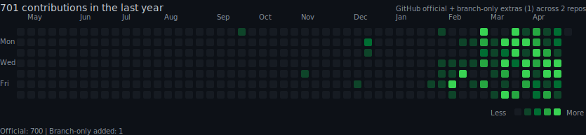

# Joseph Ruocco

Official GitHub contributions plus extra branch-only commits from local repos on this machine, rendered in a GitHub-style dark heatmap.

This graph keeps the normal public contribution history and adds branch-only commits found by scanning local git repos under your home directory.

## Update

Run `./scripts/update_profile_graph.sh` to regenerate the SVG and push the profile repo in one command.

## Exclude Paths

Edit `.branch-scan-ignore` to skip repos or folders from the local crawl.
